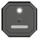
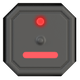
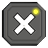
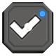
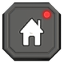
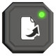
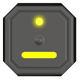
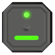
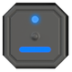

# Quick start

## Power on

Hold the gray button for 3 seconds, then let go — FREE-WILi 2 powers on.
Plugging in USB powers it on too.

## Power off

Hold the red button for 6 seconds and the device begins a safe 10-second
shutdown, then settles into a 60 µA sleep called ship mode.

## The main menu

Once it's up, you land on the main menu: a scrolling list of **panels**. Some panels are grouped
into folders (IO, Wireless, GUI, System, and others). Use **up** and
**down** on the D-pad to move through the list, and **right** (or **ok**)
to open whatever's highlighted — including opening a folder to reveal the
panels inside it. 

## On-device help

Press **Cancel** on any panel to read that panel's own help page. On a panel
that already uses Cancel for something of its own, hold it for 6 seconds
instead. Press the **Red** button on the main screen for help.

## The buttons

Four buttons beside the screen mean the same thing on every panel:

|                                                | Button     | What it does                                                             |
| ---------------------------------------------- | ---------- | ------------------------------------------------------------------------ |
|          | **Ok**     | Opens or confirms whatever is selected                                   |
|  | **Cancel** | Exits a dialog without action — or opens that screen's help page, where it has one |
|      | **Home**   | Straight back to the main menu, from anywhere                            |
|      | **Page**   | Switches to another screen within the same panel, where there is one     |

The five coloured buttons under the screen mean whatever the panel you're
looking at says they mean. The bar along the bottom of the screen always
shows their current labels, so when in doubt, read the bar.

|  |  |  |  |  |
| ------------------------------------------- | ---------------------------------------------- | -------------------------------------------- | ------------------------------------------ | ---------------------------------------- |
| Gray                                        | Yellow                                         | Green                                        | Blue                                       | Red                                      |

The D-pad moves through whatever is on screen: **up** and **down** through a
list, **left** and **right** to change a selected value, and **center** to
open or activate — the same action as Ok on the main menu.

[Screen and buttons](screen-and-buttons.md#button-map) has the full map,
including the long-press shortcuts.

## Something to try right now

No wiring, no setup: open the **GUI** folder and select **Sensors**. It
reads the onboard microphone, IMU, magnetometer, ambient light, and temperature/humidity
sensors directly — nothing to connect, nothing to configure.

From there, [Screen and buttons](screen-and-buttons.md) covers the rest of
the navigation model, and [Connecting](connecting.md) covers the other two
ways to reach the same features — from a host PC, or over a serial
terminal — if you'd rather not do everything on the small screen.
